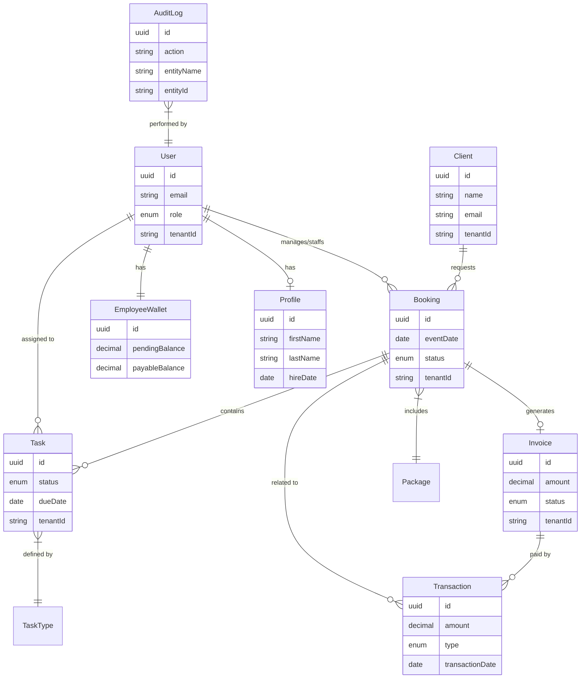

# 🎬 softY ERP

A production-ready NestJS ERP backend for photography/videography studio management.

## 🚀 Quick Start

```bash
# 1. Start infrastructure (PostgreSQL + MinIO + Redis)
docker compose up -d

# 2. Install dependencies
npm install

# 3. Copy environment file and update it with your configuration
cp .env.example .env

# 4. Start development server
npm run start:dev
```

## 🔗 Service URLs

| Service                | URL                                       | Description                                                    |
| ---------------------- | ----------------------------------------- | -------------------------------------------------------------- |
| **API Server**         | http://localhost:3000/api/v1              | REST API base                                                  |
| **Swagger Docs**       | http://localhost:3000/api/docs            | Interactive API documentation (requires `ENABLE_SWAGGER=true`) |
| **Health Check**       | http://localhost:3000/api/v1/health       | Full health status                                             |
| **Liveness Probe**     | http://localhost:3000/api/v1/health/live  | K8s liveness check                                             |
| **Readiness Probe**    | http://localhost:3000/api/v1/health/ready | K8s readiness check                                            |
| **Prometheus Metrics** | http://localhost:3000/api/v1/metrics      | Prometheus scrape endpoint (token-protected in production)     |
| **MinIO Console**      | http://localhost:9001                     | Object storage admin (minioadmin/minioadmin)                   |
| **Zipkin UI**          | http://localhost:9411                     | Distributed tracing (optional)                                 |

## 📦 Features

### Core Modules

- **Auth** - JWT authentication with refresh tokens
- **Users** - User management with roles (ADMIN, OPS_MANAGER, FIELD_STAFF)
- **Bookings** - Client booking management
- **Tasks** - Work task assignment and tracking
- **Catalog** - Service packages and task types
- **Finance** - Transactions and employee wallets
- **HR** - Employee profiles and payroll
- **Media** - File uploads via MinIO/S3

### Database Schema



### New Features (v1.1)

- **Client Portal** - Magic link authentication for clients to view bookings and profile
- **Multi-language (i18n)** - Support for English, Arabic, Kurdish, and French
- **Dashboard Analytics** - KPIs, revenue stats, booking trends, CSV/PDF export

### Production Infrastructure & Security Hardening

- 🛡️ **Composite FK Constraints** - Database-level tenant isolation enforcing cross-tenant referential integrity.
- 🛡️ **Helmet Security** - Essential HTTP security headers applied globally.
- 🛡️ **JWT-First Tenant Scoping** - Tenant derived from verified JWTs with subdomain fallback for public routes (no tenant headers).
- 🛡️ **PII Masking** - Specialized `@PII` decorator ensuring sensitive fields (emails, phones) are masked in structured logs.
- 🛡️ **Stored XSS Protection** - `@SanitizeHtml` decorator for automatic sanitization of user-provided content.
- 🛡️ **Account Lockout** - Progressive account locking to thwart brute-force attacks.
- 🛡️ **Rate Limiting** - Advanced `IpRateLimitGuard` with IP-based throttling.
- 🛡️ **Encrypted Secrets** - Webhook secrets encrypted at rest using AES-256-GCM.
- ✅ **Health Checks** - Terminus-based DB and Memory probes; deep checks add Disk, S3, and SMTP.
- ✅ **Structured Logging** - Winston-based JSON logs including correlation IDs and tenant context.
- ✅ **Telemetry** - OpenTelemetry + Zipkin for distributed tracing.
- ✅ **Database Migrations** - Robust TypeORM migration system for schema evolution.
- ✅ **Secrets Management** - Integrated support for HashiCorp Vault.
- ✅ **Docker** - Multi-stage build with `node:lts-alpine` builder and distroless runtime.
- ✅ **CI/CD** - External pipelines (not defined in this repo).
- ✅ **Payroll Reconciliation** - Automated nightly jobs to reconcile expected vs actual payouts.
- ✅ **Hardened Metrics** - Prometheus endpoint protected by `METRICS_TOKEN` with a custom Guard.

### Tenant Context

The system uses `AsyncLocalStorage` for tenant context propagation, ensuring all database queries are tenant-scoped:

- **Static API**: `TenantContextService.getTenantId()` - Direct access (used internally)
- **Injectable API**: `TenantContextProvider` - DI-friendly wrapper for easier testing

See [OPERATIONS.md](./OPERATIONS.md) for production deployment guide, environment variables, and health checks.

## 🛠 Scripts

```bash
# Development
npm run start:dev          # Start with hot-reload
npm run build              # Build for production
npm run start:prod         # Start production build

# Testing
npm run test               # Run unit tests
npm run test:integration   # Run integration tests with testcontainers
npm run test:e2e           # Run E2E tests
npm run test:cov           # Test coverage
npm run test:integration:cov # Integration test coverage

# Performance Testing
npm run test:load:auth     # Load test authentication flow
npm run test:load:booking  # Load test booking workflow
npm run test:load:finance  # Load test finance operations
npm run test:load:stress   # Stress test (500 concurrent users)
npm run test:load:all      # Run all load tests

# Database
npm run seed               # Seed database with sample data
npm run migration:generate # Generate migration from changes
npm run migration:run      # Apply pending migrations
npm run migration:revert   # Rollback last migration

# Maintenance
npm run backup             # Create database backup
npm run format             # Format code with Prettier
npm run lint               # Lint code with ESLint
```

## 🔒 Security Scanning

Automated security scanning is integrated into the CI/CD pipeline:

- **npm audit**: Scans for critical vulnerabilities in dependencies (fails build on critical findings)
- **Snyk**: Deep dependency analysis with severity thresholds (requires `SNYK_TOKEN` in GitHub secrets)
- **Security reports**: Generated as GitHub Actions artifacts

Run manually:

```bash
npm audit --audit-level=critical
```

## 🧪 Integration Testing

Comprehensive integration tests using **testcontainers** for real database testing:

### Features

- Real PostgreSQL instances via Docker containers
- Multi-tenant data isolation verification
- Composite foreign key constraint testing
- Transaction rollback scenarios
- Complex query and pagination testing

### Running Integration Tests

```bash
# Run integration tests (Docker required)
npm run test:integration

# With coverage
npm run test:integration:cov
```

### Test Coverage

- **Repositories**: Bookings, Tasks, Finance
- **Multi-tenant isolation**: Cross-tenant data access prevention
- **Database constraints**: FK constraints, check constraints
- **Transactions**: Atomic operations and rollback testing
- **Integration Scenarios**:
  - Multi-tenant data isolation verification
  - Composite foreign key constraint enforcement
  - Financial transaction rollback scenarios
  - Webhook delivery retry logic with exponential backoff
  - Nested transaction handling
  - Webhook delivery retry logic with exponential backoff

## 🧪 Testing Guidelines

For a stable and reliable testing environment, please follow these guidelines:

### Running Tests
- **Isolation**: Run tests in band to prevent race conditions and resource contention:
  ```bash
  npm run test -- --runInBand
  ```
- **Stability**: Use the stability test script to detect flaky tests:
  ```bash
  npm run test:stability
  ```

### Writing Tests
- **Secrets**: NEVER hardcode secrets in test files. Use `test/secrets.ts` which provides centralized, overridable constants.
- **Mocking**:
  - Use `jest.clearAllMocks()` in `afterEach` for resetting mock call counts.
  - Use `jest.restoreAllMocks()` when using `jest.spyOn()` to restore original implementations.
  - For tests involving global state or singletons, use `jest.resetModules()` in `beforeEach`.
- **Tenant Context**: Use `mockTenantContext(tenantId)` helper to set up tenant scoping in tests.
- **Database**: Integration tests use `testcontainers`. Ensure Docker is running.


## 📚 Documentation Index
| Category | Document | Description |
|----------|----------|-------------|
| **Getting Started** | [Onboarding](./docs/onboarding.md) | Setup, Docker, and Testing guide. |
| **Architecture** | [ADR Index](./docs/adr/) | Architectural Decision Records. |
| **Reliability** | [Chaos Experiments](./docs/reliability/chaos-experiments.md) | Database failure simulations. |
| **Reliability** | [Disaster Recovery](./docs/dr-plan.md) | Backup and Recovery procedures. |
| **Security** | [Key Rotation](./docs/security/key-rotation.md) | Policy for rotating DB/JWT secrets. |
| **Security** | [Incident Response](./docs/runbooks/security-incident.md) | Security alert playbook. |
| **Product** | [Feature Strategy](./docs/product/strategy.md) | Feature Flags and KPIs. |
| **Release** | [Deployment](./docs/release-strategy.md) | Canary/Blue-Green strategy. |
| **API** | [Versioning](./docs/api/versioning.md) | API versioning and deprecation policy. |

## 🏗 Code Quality & Architecture

### Refactoring Improvements

- **Cursor Pagination Helper**: Shared utility for consistent cursor-based pagination across all services
- **Export Service Extraction**: Separated CSV export logic into dedicated `BookingExportService`
- **Service Separation**: Extracted `ClientsService` from booking operations
- **Type Safety**: Added proper null checks and typed interfaces in CSV transform functions
- **Performance**: Fixed N+1 queries with eager loading and composite database indexes
- **Memory Management**: Added stream cleanup (try-finally) in all export methods
- **Strict Typing**: Zero `any` policy enforced across the entire codebase (production + tests)
- **Dependency Inversion**: Adoption of abstract providers (e.g., `AuditPublisher`) for better testability

### Developer Notes

#### Audit Logging Architecture
Audit logs are processed asynchronously to prevent performance bottlenecks.
- **Publisher**: Services inject `AuditPublisher` (abstract class) to log events.
- **Provider**: `AuditService` implements `AuditPublisher` and enqueues jobs to `audit-queue` (Redis/BullMQ).
- **Consumer**: `AuditProcessor` picks up jobs, fetches the previous log for the tenant, calculates the hash chain, and persists the entry.
- **Integrity**: Hash chaining includes `oldValues` and `newValues` to detect tampering.

#### MFA Security
MFA Recovery codes are stored as **bcrypt hashes** (jsonb column) instead of plain text.
- **Generation**: Codes are generated, hashed, and stored. Plain codes are returned to the user *once*.
- **Verification**: Codes are verified using `bcrypt.compare`.
- **Migration**: Existing plain-text codes (if any) are automatically hashed via migration `1681234567892`.

### Security Best Practices

#### Production Deployment Checklist

- [x] Disable Swagger in production (`ENABLE_SWAGGER=false`)
- [x] Set strong JWT secrets (minimum 32 characters, high entropy)
- [x] Enable TLS for all external services (database, MinIO, Redis, email)
- [x] Configure proper CORS origins (whitelist specific domains)
- [x] Set up HashiCorp Vault for secret management
- [x] Enable Prometheus metrics with authentication token
- [x] Configure Sentry DSN for error tracking
- [x] Review and tune rate limits per endpoint
- [x] Ensure composite FK constraints are enabled in production database
- [x] Enable database connection pooling with appropriate limits
- [x] Configure health checks with appropriate timeouts
- [x] Set up log aggregation and retention policies
- [x] Run security scans: `npm audit --audit-level=critical`
- [x] Review dependency updates monthly via Snyk

#### Data Isolation Best Practices

- **TenantAwareRepository**: Use `TenantAwareRepository<T>` for all tenant-scoped entities. It automatically applies `tenantId` to `find`, `findOne`, `save`, `remove`, and `count` operations.
- **Tenant Context**: `TenantContextService.getTenantId()` provides the current tenant ID from `AsyncLocalStorage`.
- **Multi-tenant Constraints**: Ensure composite foreign keys enforce cross-tenant isolation at the database level.
- **Query Filters**: For `createQueryBuilder`, manually add `tenantId` in WHERE clauses.
- **Transaction Boundaries**: All operations within tenant-scoped transactions.
- **Audit Trail**: Tenant ID included in all audit log entries.
- **Testing**: Verify tenant isolation with integration tests using `mockTenantContext()`.

#### API Security Guidelines

- **Rate Limiting**: Use `@RateLimit()` decorator for sensitive endpoints
- **Authentication**: JWT-only auth (remove header-based tenant identification)
- **Input Validation**: Always validate DTOs with class-validator
- **Output Encoding**: Use `@SanitizeHtml()` for user-generated content
- **PII Protection**: Sensitive fields masked in logs with `@PII()` decorator
- **Request Timeout**: Set appropriate timeouts for external calls
- **CSRF Protection**: Use SameSite cookies for auth tokens
- **Content Security**: Configure Content-Security-Policy headers

## 📝 License

MIT
