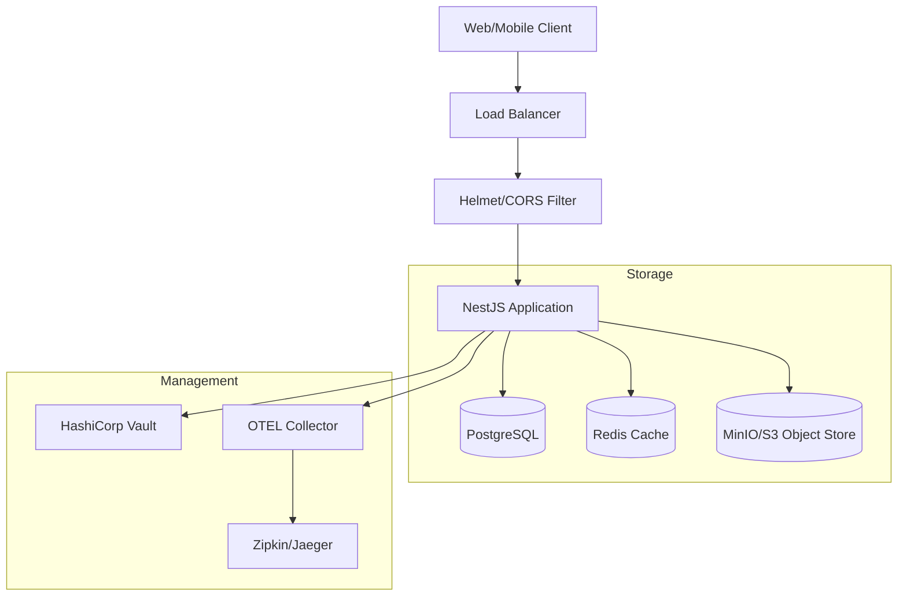

# System Architecture

## Overview
The softY ERP is a robust NestJS application designed for high security and scalability. It follows a modular monolith approach with strict domain-driven boundaries and defense-in-depth security.

## High-Level Structure

1.  **Core / Infrastructure**:
    -   `AppModule`: Root module.
    -   **Observability**: Integrated Winston logging, OpenTelemetry tracing, and Prometheus metrics (token-protected in production via `METRICS_TOKEN`).
    -   **Security**: `Helmet` integration and strict CORS policies.

2.  **Common Layer (`src/common`)**:
    -   **Tenant Context**: AsyncLocalStorage based context management.
    -   **Guards**: `JwtAuthGuard`, `RolesGuard`, and `IpRateLimitGuard`.
    -   **Decorators**: `@PII` for log masking and `@SanitizeHtml` for XSS protection.
    -   **Resilience**: Circuit breakers for external SMTP and S3 calls.

3.  **Feature Modules (`src/modules`)**:
    -   Self-contained modules with dedicated DTOs, Controllers, Services, and Entities.
    -   Modules communicate via services or internal events.

### Bookings Module Service Hierarchy

The Bookings module follows a separation-of-concerns pattern with specialized services:

| Service | Responsibility |
|---------|----------------|
| `BookingsService` | Core booking CRUD, workflow orchestration |
| `ClientsService` | Client management, tag filtering, CRUD |
| `BookingExportService` | Memory-efficient CSV streaming exports |
| `BookingStateMachineService` | State transition validation, guards |

> [!NOTE]
> See [ADR-0005](./adr/0005-service-extraction-pattern.md) for the rationale behind this extraction.

## The Security Shield

We implement multiple layers of security to protect tenant data:

### Layer 1: Edge Security
- **Rate Limiting**: IP-based throttling at the global level.
- **Header Hardening**: `Helmet` removes `X-Powered-By` and adds CSP, HSTS, and other security headers.

### Layer 2: Authentication & Authorization
- **JWT-First**: Tenant scope comes from verified JWTs; subdomain fallback is only for unauthenticated routes; if both are present they must match (no tenant headers).
- **Account Lockout**: Brute-force protection on the login endpoint.
- **RBAC**: Role-based access control enforced via high-level decorators.

### Layer 3: Application Logic
- **HTML Sanitization**: Automatic parsing and sanitization of user-provided content.
- **PII Masking**: Sensitive data is identified in DTOs and masked before reaching logs.
- **Pessimistic Locking**: Financial operations (wallets, transactions) use `pessimistic_write` locks to prevent race conditions.

### Layer 4: Data Persistence
- **Composite FK Constraints**: Database-level enforcement of tenant boundaries.
- **UUIDs**: All IDs are UUID v4 to prevent enumeration attacks.
- **Audit Logs**: Comprehensive tenant-scoped audit trails for all mutating operations.

## Resilience Mechanisms

- **Health Checks**: `/api/v1/health/live` and `/api/v1/health/ready` with DB + memory checks; deep checks add disk, S3, and SMTP.
- **Graceful Shutdown**: All connections (DB, Redis, S3) are drained before the process terminates.
- **Backup**: Automated PostgreSQL backups uploaded to MinIO/S3.
- **Distributed Locking**: Critical sections (e.g., payroll) use Redis-based locks via SET NX + Lua for safe cross-instance coordination.

## Code Quality & Standards

We enforce strict quality gates to maintain reliability and manageability:

- **Avoid `any`**: `any` is discouraged, but there are limited exceptions in guards and tests.
- **Dependency Inversion**: Services rely on abstractions (e.g., `AuditPublisher`) rather than concrete implementations.
- **Tenant Isolation**: All database interaction MUST go through `TenantAwareRepository`.

## Infrastructure Diagram

